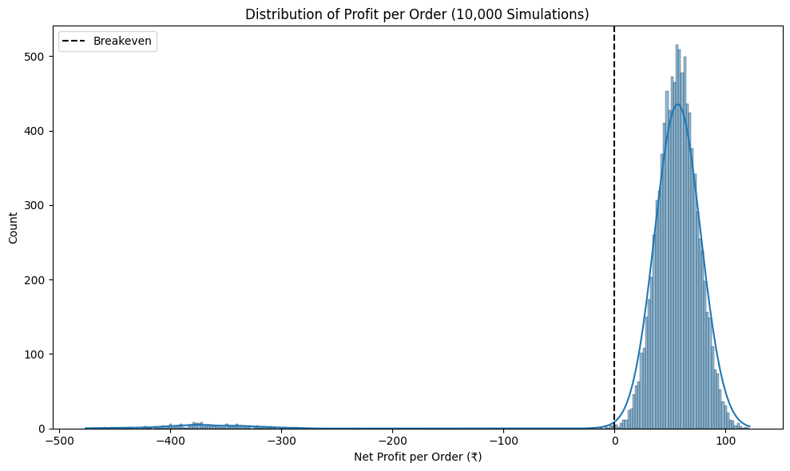
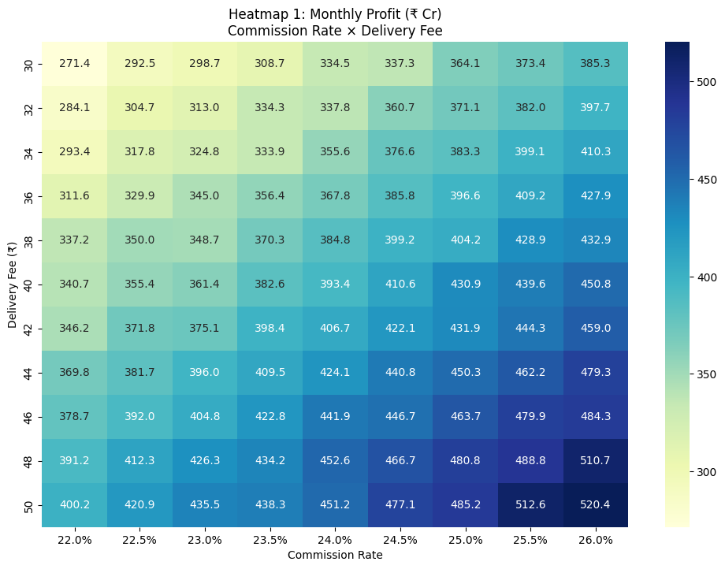
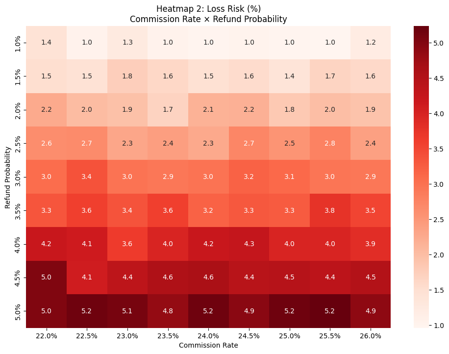

# Zomato Unit Economics & Risk Simulator (FY24)

Monte Carlo–based profitability and risk simulation framework built using Zomato FY24 food delivery economics.

This project models uncertainty across pricing, operations, customer acquisition, and refund dynamics to identify the highest-impact strategic levers affecting profitability at Zomato's scale of approximately **66 million monthly orders**.

---

## Executive Summary

### Key Finding

> **Commission rate is Zomato's highest-ROI profitability lever.**
>
> Increasing commission from **22.5% to 25%** generates approximately **₹58 Cr additional monthly profit**, outperforming a ₹5 delivery fee increase by nearly **5×**.

| Finding                        | Insight                                      |
| ------------------------------ | -------------------------------------------- |
| Strongest Profit Lever         | Commission Rate Increase (22.5% → 25%)       |
| Strongest Risk Reduction Lever | Refund Probability Reduction (2% → 1%)       |
| Largest Absolute Profit Upside | CAC Optimization (₹20 → ₹10 = +₹53 Cr/month) |
| Dominant Tail-Risk Driver      | Refund Probability                           |
| Baseline Profitability         | ₹48.26 Profit per Order                      |
| Baseline Loss Risk             | 2.2%                                         |
| Recommended Strategy           | Improve Refunds & CAC Efficiency First       |

---

## Business Problem

Food delivery platforms operate on thin margins.

Small changes in order value, delivery costs, marketing spend, or refund rates can significantly impact profitability at scale.

This simulator answers three critical business questions:

1. What does Zomato realistically earn per order under operational uncertainty?
2. Which strategic levers have the greatest impact on profitability?
3. Under what conditions does the business become unstable?

---

## Methodology

### Monte Carlo Simulation (10,000 Orders)

Instead of relying on deterministic averages, each order is simulated as a random event using calibrated FY24 distributions.

| Variable                        | Distribution     | Parameters      |
| ------------------------------- | ---------------- | --------------- |
| Average Order Value (AOV)       | Normal           | μ = 428, σ = 50 |
| Rider Cost                      | Normal           | μ = 32, σ = 10  |
| Packaging Cost                  | Normal           | μ = 12, σ = 3   |
| Customer Acquisition Cost (CAC) | Normal           | μ = 20, σ = 10  |
| Refund Event                    | Bernoulli        | p = 0.02        |
| Payment Gateway Fee             | Fixed Percentage | 2.4% of AOV     |

### Profit Formula

```text
Revenue = (AOV × Commission Rate) + Delivery Fee

Costs = Rider Cost
      + Packaging Cost
      + CAC
      + Gateway Fee
      + Refund Loss

Profit = Revenue − Costs
```

---

## Baseline FY24 Results

| Metric                   | Value       |
| ------------------------ | ----------- |
| Average Profit per Order | ₹48.26      |
| Loss Probability         | 2.20%       |
| Monthly Orders           | ~66 Million |
| Estimated Monthly Profit | ₹318.5 Cr   |

### Baseline Profit Distribution



---

## Strategic Scenario Analysis

Five strategic levers were tested using identical simulation assumptions.

| Scenario                          | Avg Profit / Order | Loss Risk | Monthly Profit | Trade-Off                     |
| --------------------------------- | ------------------ | --------- | -------------- | ----------------------------- |
| Baseline FY24                     | ₹48.26             | 2.20%     | ₹318.5 Cr      | —                             |
| +₹5 Delivery Fee                  | ₹51.31             | 1.82%     | ₹328.5 Cr      | Potential Customer Churn      |
| Refund Reduction (2% → 1%)        | ₹52.70             | 1.02%     | ₹337.4 Cr      | Stricter Operational Controls |
| Rider Cost Variance Reduction     | ₹47.49             | 2.24%     | ₹310.3 Cr      | Limited Upside                |
| CAC Reduction (₹20 → ₹10)         | ₹59.27             | 1.82%     | ₹371.6 Cr      | Potential Growth Slowdown     |
| Commission Increase (22.5% → 25%) | ₹58.24             | 2.20%     | ₹376.7 Cr      | Restaurant Churn Risk         |

> All results are based on 10,000 Monte Carlo simulations and scaled to FY24 monthly order volumes.

---

## Sensitivity Analysis

### Profit Sensitivity

**Commission Rate × Delivery Fee**



Key Observation:

* Profitability increases sharply with commission rate.
* Delivery fee increases create only linear gains.
* Commission increases create amplified effects at scale.

**Most attractive profit zone:**
25–26% commission and ₹44–₹50 delivery fee.

---

### Risk Sensitivity

**Commission Rate × Refund Probability**



Key Observation:

* Refund probability is the dominant driver of tail risk.
* Higher commissions cannot offset operational failures.
* Loss risk accelerates rapidly beyond a 3–4% refund rate.

**Operational excellence matters more than monetization when reducing downside risk.**

---

## Strategic Recommendations

### 1. Prioritize Refund Reduction

Reducing refunds from 2% to 1%:

* Increases profitability
* Cuts loss probability by more than 50%
* Preserves customer trust

Recommended actions:

* Improve order accuracy
* Enhance packaging quality
* Strengthen customer communication

---

### 2. Improve CAC Efficiency

Focus on acquisition efficiency rather than blanket cost cutting.

Recommended actions:

* Cohort-based promotions
* Loyalty-driven retention
* Personalized incentives

Potential upside:

**+₹53 Cr monthly profit**

---

### 3. Use Dynamic Delivery Pricing

Increase delivery fees selectively:

* Peak-demand periods
* High-congestion zones
* Adverse weather conditions

This minimizes customer churn while improving margins.

---

### 4. Treat Commission Increases Carefully

Commission increases can generate significant profit gains but may lead to:

* Restaurant dissatisfaction
* Platform disintermediation
* Competitive migration

If implemented, pair with value-added offerings such as:

* Sponsored listings
* Restaurant analytics
* Marketing tools

---

### 5. Optimize Routing, Not Rider Pay

Reducing rider cost variance provides operational stability without damaging supply incentives.

Focus areas:

* Route optimization
* Order batching
* Demand forecasting

---

## Limitations

This model intentionally simplifies several real-world dynamics.

Not included:

* Customer churn behavior
* Restaurant churn behavior
* City-level demand variation
* Time-of-day effects
* Correlated cost variables
* Long-term competitive responses

Results should be interpreted as directional strategic guidance rather than exact forecasts.

---

## Project Structure

```text
zomato-unit-economics-simulator/
│
├── notebooks/
│   ├── 01_baseline_monte_carlo.ipynb
│   ├── 02_scenarios_engine.ipynb
│   └── 03_sensitivity_heatmaps.ipynb
│
├── reports/
│   ├── Zomato_Unit_Economics_&_Risk_Simulator_(FY24).pptx
│   └── Zomato_Unit_Economics_&_Risk_Simulator_(FY24).pdf
│
├── assets/
│   ├── heatmap_profit.png
│   ├── heatmap_risk.png
│   └── histogram_baseline.png
│
├── requirements.txt
└── README.md
```

---

## Installation

```bash
git clone https://github.com/Kushagra-1210/zomato-unit-economics-simulator.git

cd zomato-unit-economics-simulator

pip install -r requirements.txt
```

---

## Usage

Run notebooks sequentially:

1. `01_baseline_monte_carlo.ipynb`
2. `02_scenarios_engine.ipynb`
3. `03_sensitivity_heatmaps.ipynb`

The notebooks automatically generate:

* Profit distributions
* Strategic scenario comparisons
* Sensitivity heatmaps
* Business recommendations

---

## Skills Demonstrated

* Monte Carlo Simulation
* Business Strategy Analysis
* Unit Economics Modeling
* Risk Assessment
* Sensitivity Analysis
* Python Data Science
* Financial Modeling
* Product & Operations Strategy

---

## Author

**Kushagra Bansal**
B.Tech, Computer Science & Engineering
Shiv Nadar University (2024–2028)

**LinkedIn:** https://www.linkedin.com/in/kushagra-kb1210
**GitHub:** https://github.com/Kushagra-1210

---

### Disclaimer

This project is an independent educational and analytical study based on publicly available FY24 information. It is not affiliated with or endorsed by Zomato.
